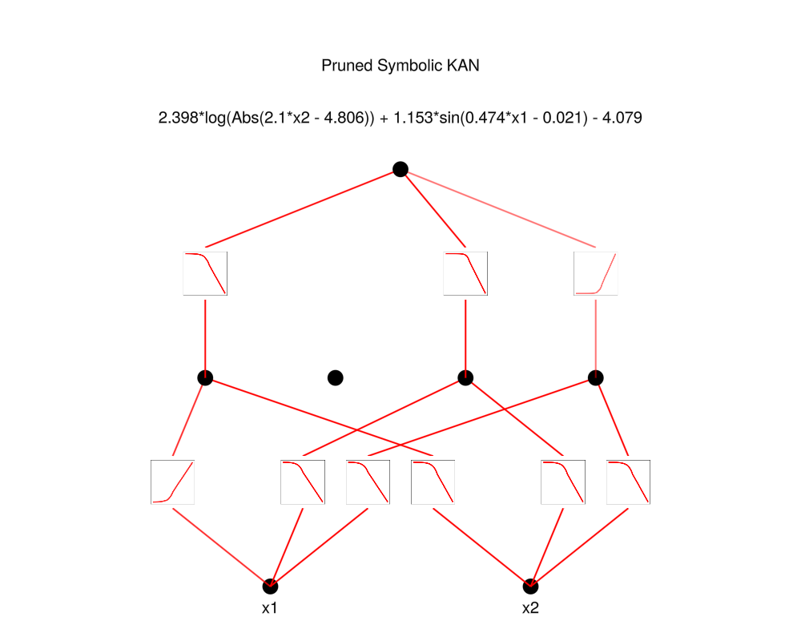

# symbolicKAN

Julia implementation of B-spline KAN for symbolic regression - recreated pretty much as is from [pykan](https://github.com/KindXiaoming/pykan) on a smaller scale to develop understanding.

WORK IN PROGRESS 

Thank you to KindXiaoming and the rest of the KAN community for putting this awesome network out there for the world to see.

<p align="center">


</p>


## To run

1. Precompile packages:

```bash
bash setup/setup.sh
```

2. Unit tests:

```bash
bash src/unit_tests/run_tests.sh
```

3. Generate double pendulum data, (and also plot)

```bash
julia --sysimage precompile.so data/double_pendulum/double_pendulum.jl
```

4. Try predicting

```bash
julia --sysimage precompile.so main.jl
```

## TODO

1. Feynmann Dataset


## Note from author.

As a first task, I chose to apply the KAN towards predicting the double pendulum because it's quick to implement, and looks cool as a GIF. Besides, I'm interested to see whether or not the symbolic KAN can unpack its formuala, (probably not). But the double pendulum is a sequence modelling problem, so a simple FCNN (fully connected neural net) is a horrible choice of architecture to do this with.
