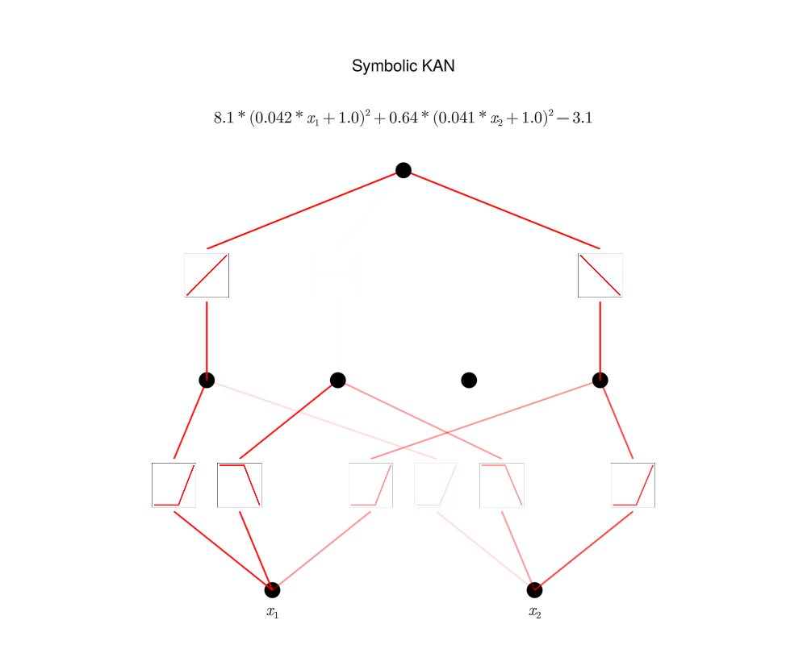

# symbolicKAN

Julia implementation of B-spline KAN for symbolic regression - recreated pretty much as is from [pykan](https://github.com/KindXiaoming/pykan) on a smaller scale to develop understanding.

WORK IN PROGRESS 

Thank you to KindXiaoming and the rest of the KAN community for putting this awesome network out there for the world to see.

<p align="center">


</p>


## To run

1. Precompile packages:

```bash
bash setup/setup.sh
```

2. Unit tests:

```bash
bash src/unit_tests/run_tests.sh
```

3. [Setup config file.](config/config.ini) 

4. Run some files

- Symbolic regression on user-defined formula:

```bash
julia --sysimage precompile.so pred_multiply.jl
```
## [Configuration File](config/config.ini) 

### Architecture
- **k**: Degree of spline basis functions. Determines the smoothness of the spline functions used.
- **G**: Grid number. Specifies the number of grid points in the grid used for splines.
- **λ**: Overall regularization parameter. Controls the trade-off between fitting the data and regularizing the model.
- **λ_l1**: L1 regularization parameter. Applied to encourage sparsity in the model coefficients.
- **λ_entropy**: Entropy regularization parameter. Used to limit the number of active activations, promoting a more compact model.
- **λ_coef**: Coefficient regularization parameter. Regularizes the coefficients to avoid overfitting.
- **λ_coefdiff**: Coefficient difference regularization parameter. Helps in controlling the differences between coefficients, ensuring smoothness in the model.

### Optimizer
- **type**: Optimization algorithm to use. Choices include `bfgs`, `l-bfgs`, `cg`, `newton`, or `interior-point`.
- **linesearch**: Type of linesearch algorithm. Options are `strongwolfe`, `backtrack`, `hagerzhang`, `morethuente`, or `static`.
- **m**: Number of previous iterations to store for the strong Wolfe linesearch method. Influences the history of past gradients used for better convergence.
- **c_1**: Armijo condition parameter for linesearch. Used to ensure sufficient decrease in the objective function.
- **c_2**: Second Wolfe condition parameter. Ensures the step size satisfies the curvature condition.
- **ρ**: Bracket expansion factor. Determines the factor by which the interval for the step size is expanded during the linesearch.
- **α0**: Initital step size for linesearch.

### Pipeline
- **num_epochs**: Number of training epochs. Defines how many times the training process will iterate over the entire dataset.
- **num_grid_updates**: Number of times to update the grid. Indicates how frequently the grid used for interpolation or approximation will be updated during training.
- **final_grid_epoch**: Epoch at which to stop updating the grid. Defines when to cease further updates to the grid.
- **normalise_data**: Flag indicating whether to normalize the input data. `true` or `false` value determines if the input data should be scaled.
- **input_lower_lim**: Lower limit for input values. Specifies the minimum value of the input data.
- **input_upper_lim**: Upper limit for input values. Specifies the maximum value of the input data.
- **N_train**: Number of training samples. Specifies the size of the training dataset.
- **N_test**: Number of testing samples. Specifies the size of the testing dataset.

### Param fitting
- **num_g**: Number of evaluation points used in grid search.
- **iters**: Number of iterations to run grid search for.
- **coeff_type**: Either R2 or pearson to fit the inner affine parameters to.

## References

- [Liu, Z., Wang, Y., Vaidya, S., Ruehle, F., Halverson, J., Soljačić, M., Hou, T. Y., & Tegmark, M. (2024). KAN: Kolmogorov-Arnold Networks.](https://arxiv.org/abs/2404.19756)
- [Dixit, V. K., & Rackauckas, C. (2023). Optimization.jl: A Unified Optimization Package (v3.12.1).](https://doi.org/10.5281/zenodo.7738525)


## TODO

<!-- 1. GPU - currently doesn't work -->
1. Feynmann Dataset?
2. StaticArrays or similar for performance


