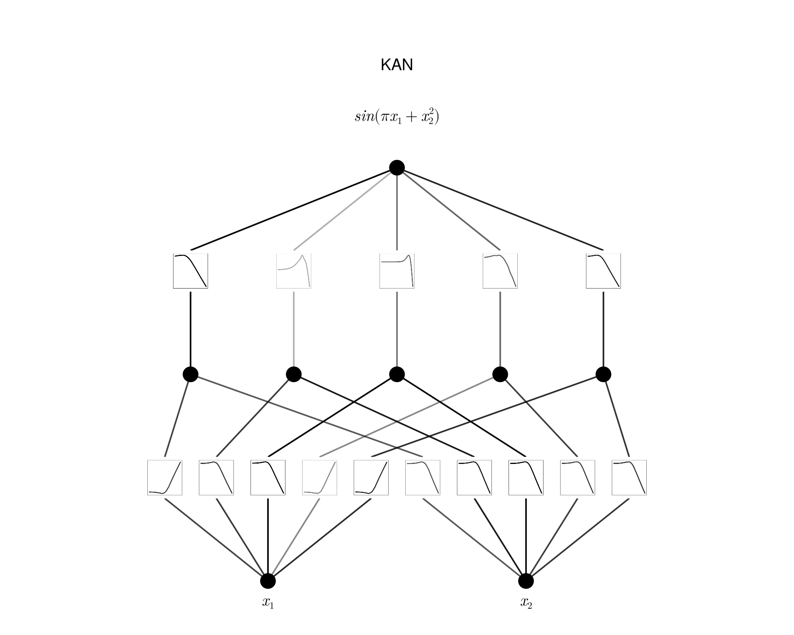
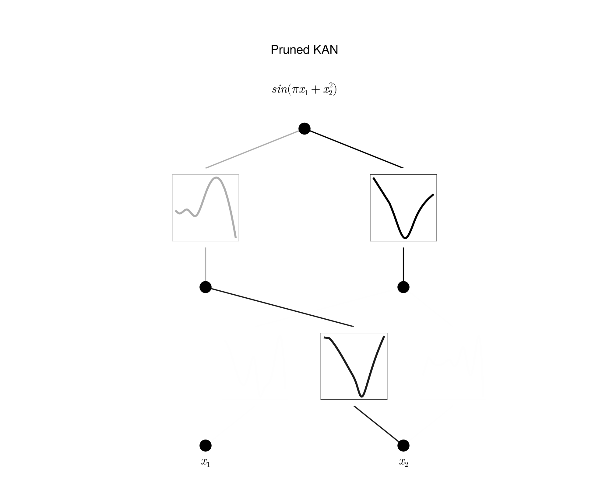
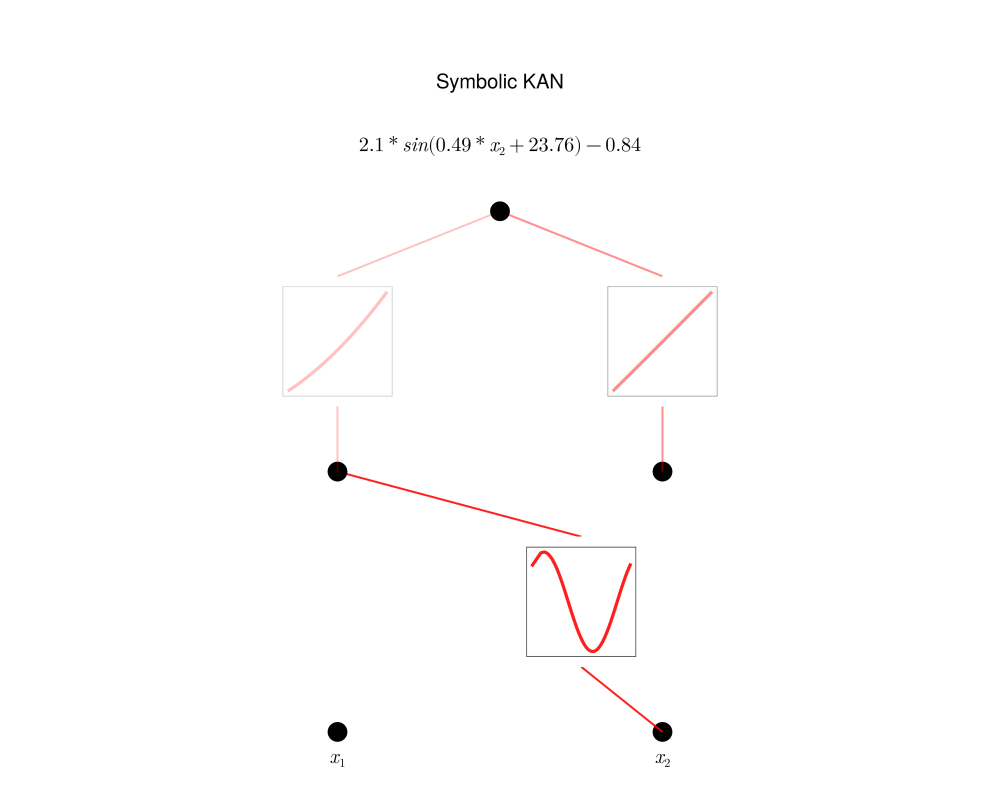

# symbolicKAN

Julia implementation of B-spline KAN for symbolic regression - recreated pretty much as is from [pykan](https://github.com/KindXiaoming/pykan) on a smaller scale to develop understanding.

WORK IN PROGRESS 

Thank you to KindXiaoming and the rest of the KAN community for putting this awesome network out there for the world to see.

<p align="center">



</p>


## To run

1. Precompile packages:

```bash
bash setup/setup.sh
```

2. Unit tests:

```bash
bash src/unit_tests/run_tests.sh
```

3. [Setup config file.](config) 

4. Run some files

- Symbolic regression on user-defined formula:

```bash
julia --sysimage precompile.so pred_function.jl
```
## [Configuration Files](config) 

### Architecture
- **k**: Degree of spline basis functions. Determines the smoothness of the spline functions used.
- **G**: Grid number. Specifies the number of grid points in the grid used for splines.
- **λ**: Overall regularization parameter. Controls the trade-off between fitting the data and regularizing the model.
- **λ_l1**: L1 regularization parameter. Applied to encourage sparsity in the model coefficients.
- **λ_entropy**: Entropy regularization parameter. Used to limit the number of active activations, promoting a more compact model.
- **λ_coef**: Coefficient regularization parameter. Regularizes the coefficients to avoid overfitting.
- **λ_coefdiff**: Coefficient difference regularization parameter. Helps in controlling the differences between coefficients, ensuring smoothness in the model.
- **sparse_init**: Whether to initialise the model sparsely or not.
- **grid_lower_lim**: Lower bound on spline grid during initialisation
- **grid_upper_lim**: Upper bound on spline grid during initialisation
- **method**: Type of spline: spline or RBF
- **base_init_scale**: Sacling applied to base activation term
- **base_activation**: Type of base activation. Choices include `silu`, `relu`, `selu`, `tanh`

### Optimiser

Note: there are two optimisers here: primary and secondary. The secondary optimisation starts after the first has completed. This has been included to allow for chained optimisations. 

E.g., to help explore the non-convexity of functions, a stochastic optimisation approach like adam could be adopted first before a secondary deterministic method, like bfgs. Or perhaps a second-order method could be adopted after a first-order method to refine the solution. 

If a secondary optimisation isn't needed, set `type=nothing` under secondary optimiser in the config file.

SECOND-ORDER OPTIMISATION IS ONLY SUPPORTED FOR THE SECONDARY OPTIMISER.

- **type**: Optimization algorithm to use. Choices include `bfgs`, `l-bfgs`, `cg`, `newton`, `interior-point`
- **linesearch**: Type of linesearch algorithm. Options are `strongwolfe`, `backtrack`, `hagerzhang`, `morethuente`, or `static`.
- **m**: Number of previous iterations to store for the strong Wolfe linesearch method. Influences the history of past gradients used for better convergence.
- **c_1**: Armijo condition parameter for linesearch. Used to ensure sufficient decrease in the objective function.
- **c_2**: Second Wolfe condition parameter. Ensures the step size satisfies the curvature condition.
- **ρ**: Bracket expansion factor. Determines the factor by which the interval for the step size is expanded during the linesearch.
- **α0**: Initital step size for linesearch.
- **max_iters**: Total number of iterations permissible to this optimisation algorithm.

### Schedulers
- **init_stochasticity**: Initial value for noise term to add to gradients, (noise injection may help with exploration)
- **stochasticity_decay**: How much to decay stochasticity per epoch, (i.e. term is multiplied by this each epoch)
- **init_grid_update_freq**: Initial frequency of grid updates, (i.e. every `init_grid_update_freq` iterations in optimisation, spline grids are updated)
- **grid_update_freq_decay**: Amount is multiplied to grid update frequency each time a grid update takes place.

### Pipeline
- **normalise_data**: Flag indicating whether to normalize the input data. `true` or `false` value determines if the input data should be scaled.
- **input_lower_lim**: Lower limit for input values. Specifies the minimum value of the input data.
- **input_upper_lim**: Upper limit for input values. Specifies the maximum value of the input data.
- **N_train**: Number of training samples. Specifies the size of the training dataset.
- **N_test**: Number of testing samples. Specifies the size of the testing dataset.
- **trainable_bias**: Determines whether the bias added to the output of the KAN model is trainable or not. Set to true when the problem function has a bias.
- **batch_size**: Batch size. Set batch_size=*value assigned to `N_train`* to remove batching.

### Param fitting
- **num_g**: Number of evaluation points used in grid search.
- **iters**: Number of iterations to run grid search for.
- **coeff_type**: Either R2 or pearson to fit the inner affine parameters to.

## Physics-informed Neural Network Data and Problem Setup

The dataset has been sourced from the University of Cambridge Engineering Department's Part IIB course on [Data-Driven and Learning-Based Methods in Mechanics and Materials.](https://teaching.eng.cam.ac.uk/content/engineering-tripos-part-iib-4c11-data-driven-and-learning-based-methods-mechanics-and)


The aim is to solve the following linear elastic boundary 2D 'Plate with a Hole' (under plane stress assumptions):


 **Young's Modulus (E)**: `E = 10 N/m²`  
**Poisson's Ratio (ν)**: `ν = 0.3`  
**Plate Thickness (t)**: `t = 1 m`  
**Traction on Edge 1 (σ₁)**: `σ₁ = 0.1 N/m²`  
**Traction on Edge 2 (σ₂)**: `σ₂ = 0 N/m²`  

The governing PDE is the equation of linear elasticity under plane stress assumptions:

$$ \nabla \cdot \sigma = 0 $$

Here, σ is the stress tensor, expressed in terms of the displacement field $\bf{u}$ and material properties as:

$$ \sigma = C\epsilon(\bf{u}) $$

$$
\epsilon = \begin{bmatrix}
\epsilon_{xx} & \epsilon_{xy} \\
\epsilon_{xy} & \epsilon_{yy}
\end{bmatrix} = \begin{bmatrix}
\frac{\partial u}{\partial x} & \frac{1}{2}\left(\frac{\partial v}{\partial x} + \frac{\partial u}{\partial y}\right) \\
\frac{1}{2}\left(\frac{\partial v}{\partial x} + \frac{\partial u}{\partial y}\right) & \frac{\partial v}{\partial y}
\end{bmatrix}
$$


Where $\bf{u} = \begin{bmatrix}u & v\end{bmatrix}^T$ are the displacements in the $x$ and $y$ directions.

$C$ is the elasticity tensor for the material, which encapsulates its fundamental properties through its dependence on $E$, the Young's modulus, and $\nu$, its Poisson's ratio.

### Boundary Conditions

The boundary conditions are:

1. Right edge ($x = 1$):
    - $\sigma_{11} = \tau_R = 0.1$ (traction)
    - $\sigma_{12} = 0$
2. Top edge ($y = 1$):
    - $\sigma_{22} = \tau_T = 0$ (traction)
    - $\sigma_{12} = 0$
3. Left edge ($x = 0$):
    - $u = 0$ (symmetry)
4. Bottom edge ($y = 0$):
    - $v = 0$ (symmetry)
5. Circle/hole boundary:
    - Traction free, i.e., $\sigma \cdot n = 0$, where $n$ is the outward normal vector on the circle boundary.


## References

- [Liu, Z., Wang, Y., Vaidya, S., Ruehle, F., Halverson, J., Soljačić, M., Hou, T. Y., & Tegmark, M. (2024). KAN: Kolmogorov-Arnold Networks.](https://arxiv.org/abs/2404.19756)
- [Dixit, V. K., & Rackauckas, C. (2023). Optimization.jl: A Unified Optimization Package (v3.12.1).](https://doi.org/10.5281/zenodo.7738525)
- [Liu, B., Cicirello, A. (2024). Cambridge University Engineering Department Part IIB Course on Data-Driven and Learning-Based Methods in Mechanics and Materials.](https://teaching.eng.cam.ac.uk/content/engineering-tripos-part-iib-4c11-data-driven-and-learning-based-methods-mechanics-and)


## TODO

1. PINN
2. Profile FLOPS/MEM
3. Feynmann Dataset?


