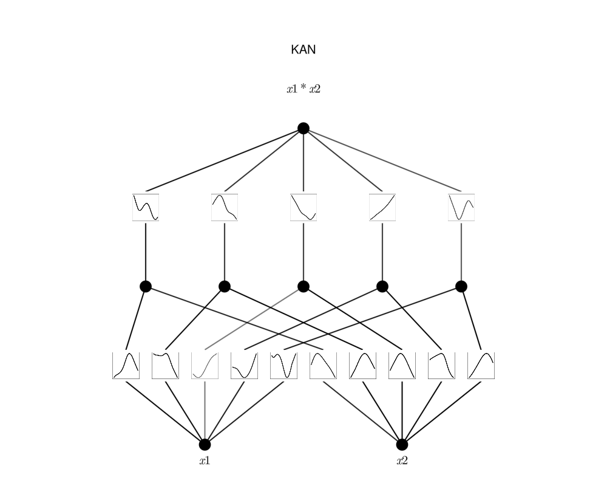

# symbolicKAN

Julia implementation of B-spline KAN for symbolic regression - recreated pretty much as is from [pykan](https://github.com/KindXiaoming/pykan).

WORK IN PROGRESS 

Huge thank you to KindXiaoming and the rest of the KAN community for putting this awesome network out there for the world to see.

<p align="center">


## To run

1. Precompile packages:

```bash
bash setup.sh
```

2. Unit tests:

```bash
bash src/unit_tests/run_tests.sh
```

3. Work in progress

## TODO

1. Symbolic regression
2. CUDA
3. Optim for L-BFGS